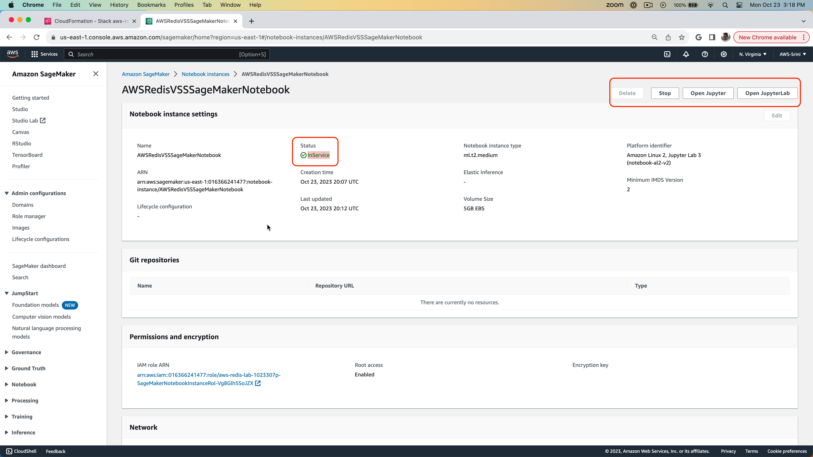

# Lab 1 - Infra setup

Duration: 10 mins

In this lab, you are going to use CloudFormation template to setup the following infrastructure in AWS.
- Amazon SageMaker Notebook instance
- Required IAM roles and policies.

## Steps

1. From the AWS web console, start by searching for `CloudFormation` and open the service in a new window.
   

2. Go ahead and click on `Create Stack`
   

3. Choose the options shown and for the `S3URL` , give the value as `https://redis-vss-getting-started.s3.amazonaws.com/setup-cloud-formation-template.yaml`
Click `Next`

4. Give a name to the stack.
   

5. Click acknowledgement and hit `Submit`
   

6. CloudFormation starts provisioning the cloud resources. In the `Resources` tab, you will start seeing that the resources will get started provisioning.

7. Notice in the `Events` tab, how the resources are getting provisioned.
   

8. While the resources are getting provisioned, search for `SageMaker` service and open the service user interface in another tab of your browser.
   

9. Go to "Amazon SageMaker" ==> "Notebook instances". You can see that a notebook instance is being provisioned and is currently in the `Pending` status. After it successfully gets provisioned, you will see that the status will be `InService`. Go ahead and click on the Notebook instance.
    

10. Since the Notebook is still in `Pending` status, you will see that the Jupyter Notebook options are all greyed out for you.
    

11. Once the notebook is provisioned, the status is changed to `InService` and Jupyter Notebook buttons are all enabled now.
    

12. Jupyter Notebook is all ready for you to get started. On the left hand navigation bar, you will see a Jupter notebook. Double click on this to open the notebook.
    

13. This will open the notebook and please select the `conda_python3` environment as your runtime. Hit the `Select` button. Your notebook is ready to be executed. But do not yet. Go to the next lab.
    

[<< Previous Lab (0) <<](../Lab&#32;0&#32;-&#32;Signup&#32;for&#32;AWS/README.md)     |      [>> Next Lab (2) >>](../Lab&#32;2&#32;-&#32;Redis&#32;Enterprise&#32;Cloud&#32;Setup/README.md)
