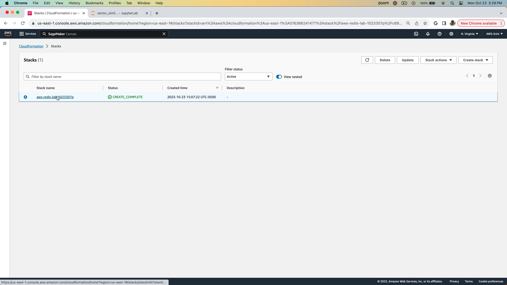
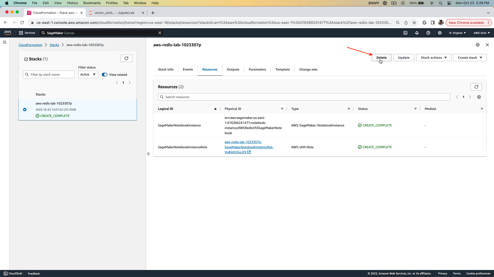
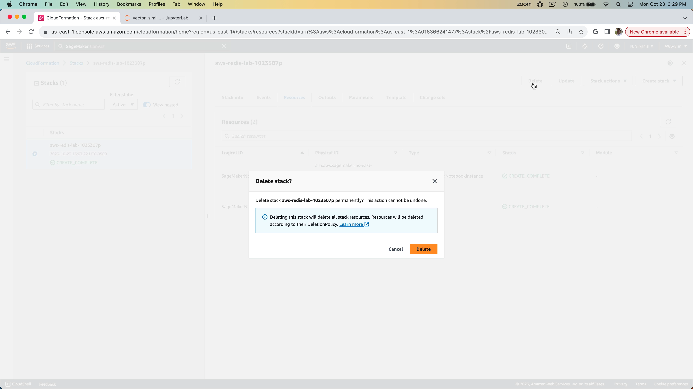
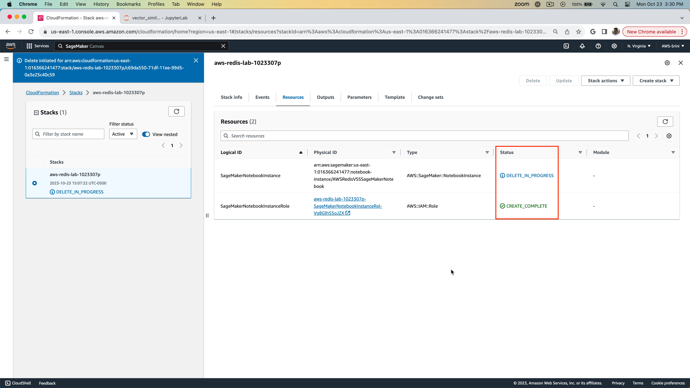
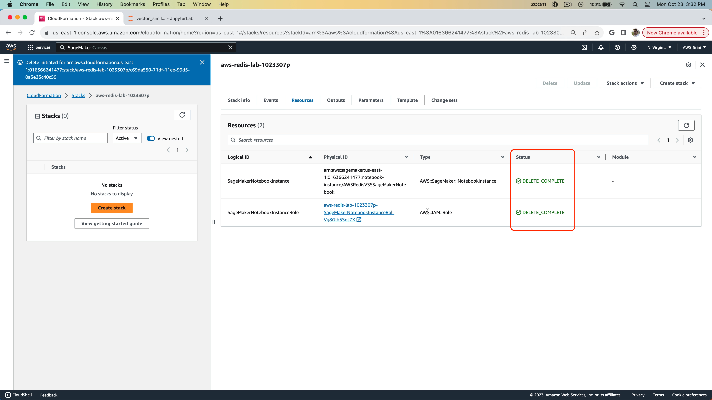

# Lab 4 - Cleanup
Duration: 5 mins

In this lab, you are going to use CloudFormation template to cleanup all of the resources you have provisioned in AWS, namely:
- Amazon SageMaker Notebook instance
- Required IAM roles and policies.

## Steps

1. Go ahead and access the Cloud Formation stack you have created during the Lab 0.
   

2. On the `Resources` tab, you can see the list of resources you have provisioned. Click on the `Delete` button to delete all of the resources.
   

3. Go ahead and delete.
   

4. Notice how in the `Resources` tab, the Resources will start getting deleted.
   

5. After all of the resources are deleted, you will see this.
    

You are all set and done. Congratulations in finishing the labs.

[<< Previous Lab (3) <<](../Lab&#32;3&#32;-&#32;Getting&#32;started&#32;with&#32;VSS&#32;on&#32;Redis&#32;Enterprise&#32;Cloud)
